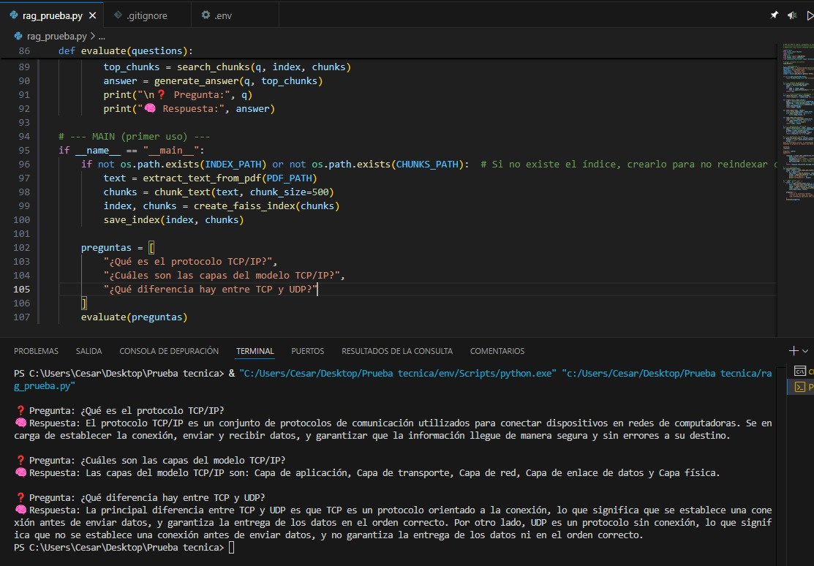

#  RAG Multilingüe con LLMs - Prueba Técnica

Este proyecto implementa una solución de **Recuperación Aumentada con Generación (RAG)** que permite responder preguntas en **español** sobre un documento técnico en **inglés** (ej. IBM TCP/IP Redbook).  
Combina recuperación semántica con FAISS, embeddings multilingües y generación de texto con un modelo LLM (GPT-3.5 Turbo).

---

##  ¿Qué hace este proyecto?

1. **Ingesta** de un PDF técnico (`docs/gg243376.pdf`).
2. División en fragmentos (*chunks*) y generación de embeddings multilingües.
3. Indexación semántica con **FAISS**.
4. Respuesta automática usando GPT-3.5 Turbo en español.
5. Interacción en consola en lenguaje natural.

---

##  Requisitos

- Python 3.9+
- OpenAI API Key válida

---

##  Estructura del proyecto
PRUEBA_TECNICA/
│
├── docs/ # Contiene el PDF técnico
│ └── gg243376.pdf
│
├── env/ # Entorno virtual (en .gitignore)
├── .env # Variables de entorno (API Key)
├── .gitignore # Archivos ignorados por Git
│
├── rag_chunks.pkl # Fragmentos de texto ya procesados (binario)
├── rag_index.index # Índice FAISS persistente (binario)
│
├── rag_prueba.py # Script principal para usar el sistema RAG
├── requirements.txt # Lista de dependencias


##  Variables de entorno

Crea un archivo `.env` con tu clave de OpenAI:

```bash
OPENAI_API_KEY=sk-xxxxxxxxxxxxxxxxxxxxxxxxxxxxxxxxxxxxxxxx

## Clona el repositorio
git clone https://github.com/CesarWKR/Rag-prueba.git
cd PRUEBA_TECNICA

## python -m venv env
source env/bin/activate  # Windows: env\Scripts\activate
pip install -r requirements.txt


## Coloca el PDF en docs/gg243376.pdf.


## Ejecución
python rag_prueba.py


## Resultado


